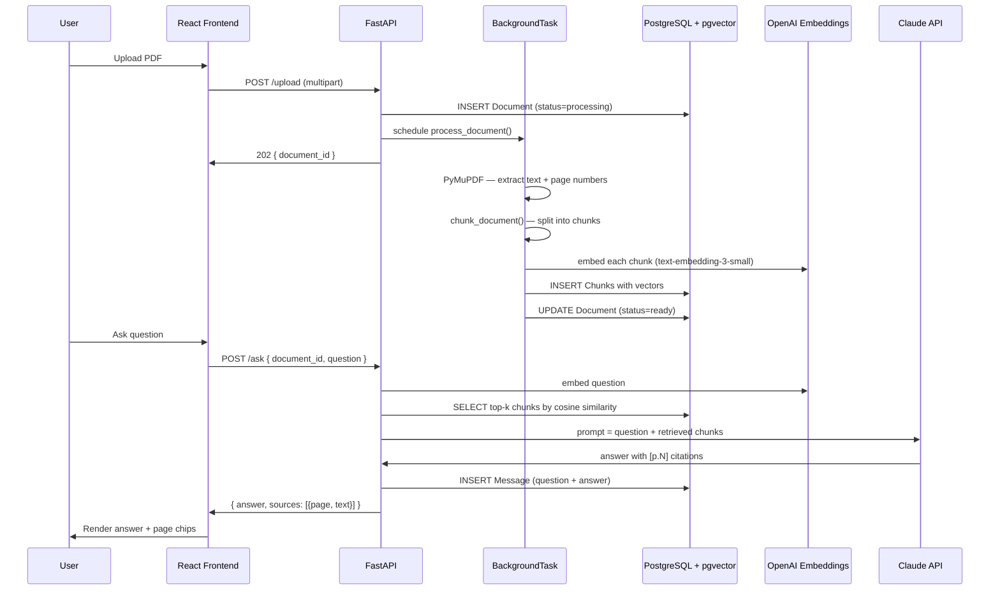

# RAG Note App — PDF Q&A Tool

Upload a PDF, ask questions in plain English, get answers with page-number citations. Built with FastAPI, pgvector, OpenAI embeddings, and Claude.

---

## Architecture



---

## Tech Stack

| Layer | Technology | Why |
|-------|-----------|-----|
| Backend | FastAPI + Python 3.12 | Async, type-safe, native BackgroundTasks |
| Database | PostgreSQL 16 + pgvector | One DB for metadata + vector search (no Pinecone) |
| PDF parsing | PyMuPDF (fitz) | Fast, accurate, preserves page numbers |
| Embeddings | OpenAI `text-embedding-3-small` | 1536-dim, cheap, strong retrieval |
| LLM | Anthropic Claude (`claude-sonnet-4-5`) | Best long-context reasoning |
| Frontend | React 18 + TypeScript + Tailwind + Vite | Fast dev, type-safe API calls |
| Data fetching | React Query (TanStack Query) | Loading states, caching, polling for processing status |
| Deployment | Docker Compose | One command to run everything |

---

## Project Structure

```
rag_note_app/
├── backend/
│   ├── app/
│   │   ├── main.py                   # FastAPI app factory
│   │   ├── api/
│   │   │   ├── upload.py             # POST /upload, GET /documents/{id}
│   │   │   └── chat.py               # POST /ask, GET /conversations/{id}
│   │   ├── services/
│   │   │   ├── pdf_parser.py         # PyMuPDF: text + page numbers
│   │   │   ├── chunking.py           # In Progress
│   │   │   ├── embedder.py           # OpenAI embedding calls
│   │   │   ├── vector_store.py       # pgvector INSERT + similarity search
│   │   │   ├── rag.py                # retrieve chunks → call Claude
│   │   │   └── prompt.py             # In Progress
│   │   ├── models/
│   │   │   └── database.py           # User, Document, Chunk, Conversation, Message
│   │   ├── schemas/
│   │   │   └── schemas.py            # Pydantic request/response models
│   │   └── core/
│   │       └── config.py             # Pydantic settings (env vars)
│   ├── tests/
│   │   ├── test_upload.py
│   │   └── test_chat.py
│   ├── Dockerfile
│   └── requirements.txt
├── frontend/
│   └── src/
│       ├── pages/
│       │   ├── UploadPage.tsx        # drag-drop upload + processing poll
│       │   └── ChatPage.tsx          # chat UI
│       ├── components/
│       │   └── ChatMessage.tsx       # message bubble + page citation chips
│       ├── services/
│       │   └── api.ts                # typed fetch wrappers
│       ├── App.tsx
│       └── main.tsx
├── docker-compose.yml
├── README.md
└── ARCHITECTURE.md
```

---

## Quick Start

### Prerequisites
- Docker + Docker Compose
- OpenAI API key
- Anthropic API key

### 1. Configure environment

```bash
cp backend/.env.example backend/.env
# Fill in:
#   OPENAI_API_KEY=sk-...
#   ANTHROPIC_API_KEY=sk-ant-...
```

### 2. Start everything

```bash
docker-compose up --build
```

| Service | URL |
|---------|-----|
| Frontend | http://localhost:5173 |
| Backend API | http://localhost:8000 |
| API docs | http://localhost:8000/docs |
| PostgreSQL | localhost:5432 |

### 3. Use it

1. Open http://localhost:5173
2. Drag and drop a PDF onto the upload page
3. Wait for the "Ready" badge (processing typically takes 5–30 seconds)
4. Click the document → ask any question
5. Answers include **[p.N]** page citations — click to jump to the source chunk

---

## API Reference

### `POST /upload`
Upload a PDF for processing.

**Request**: `multipart/form-data` with field `file` (PDF)

**Response** `202`:
```json
{ "document_id": "uuid", "status": "processing" }
```

---

### `GET /documents/{id}`
Poll processing status.

**Response** `200`:
```json
{
  "id": "uuid",
  "filename": "paper.pdf",
  "status": "ready",   // "processing" | "ready" | "failed"
  "page_count": 24,
  "chunk_count": 87,
  "created_at": "2026-05-26T10:00:00Z"
}
```

---

### `POST /ask`
Ask a question about a document.

**Request**:
```json
{
  "document_id": "uuid",
  "question": "What is the main contribution of this paper?",
  "conversation_id": "uuid (optional, for multi-turn)"
}
```

**Response** `200`:
```json
{
  "answer": "The main contribution is... [p.3] ... as discussed in [p.7]",
  "sources": [
    { "page": 3, "text": "We propose a novel approach...", "score": 0.92 },
    { "page": 7, "text": "Our method outperforms...", "score": 0.87 }
  ],
  "conversation_id": "uuid",
  "message_id": "uuid"
}
```

